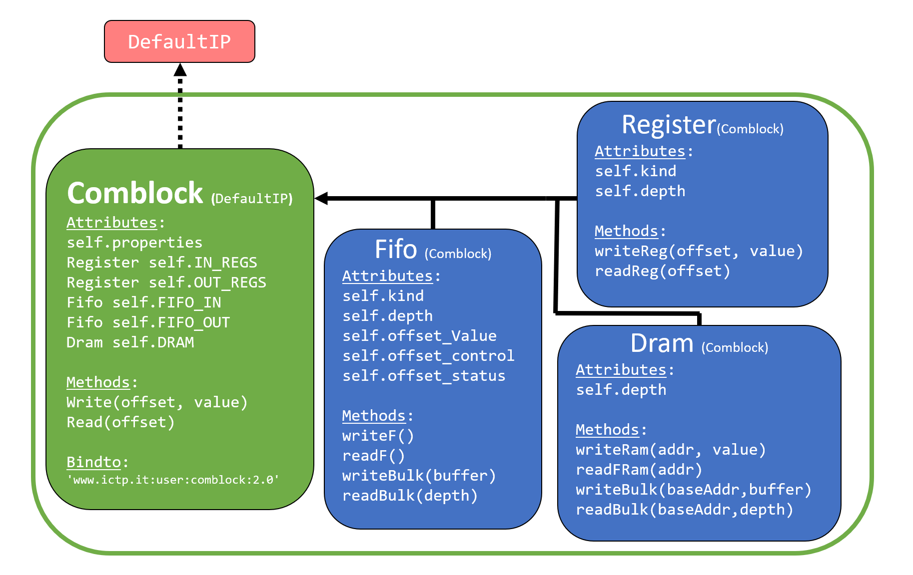
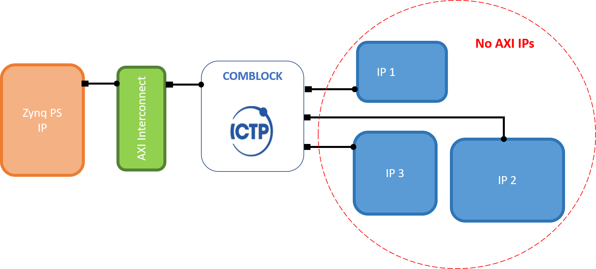

# Comblock PYNQ API

El aplicativo para Python del módulo de comunicación *Core Comblock* es producto del desarrollo de un sistema de adquisición y control de datos genérico para la experimentación avanzada en los laboratorios investigativos de la universidad de Antioquia. 

Usando la metodología para la creación de aplicativos personalizados de [PYNQ](https://pynq.readthedocs.io/en/v2.3/overlay_design_methodology/python_overlay_api.html) se creó el paquete **comblock** que define una clase
con la siguiente estructura. 

El módulo de comunicación comblock es un IP creado con el fin de simplificar el proceso de intercomunicación entre los componentes del sistema de procesamiento (PS) y de la lógica programable (PL) de un sistema embebido implementado en chips que integran las FPGA con los procesadores como lo es la serie de dispositivos Zynq-7000 de la compañía Xilinx. A continuación se presenta un diagraam que ilustra la inclusión del comblock como intermediario en el proceso de interconexión de los componentes de un sistema embebido.

Para más información respecto a este IP puede consultar el [repositorio](https://gitlab.com/rodrigomelo9/core-comblock) de sus autores.

*Licencia*
----
El código fuente del aplicativo y su ejemplo de testeo están sujetos a la licencia [BSD 3-Clause](https://github.com/DanielEstrada971102/Comblock-PYNQ-API/blob/main/LICENSE). 
