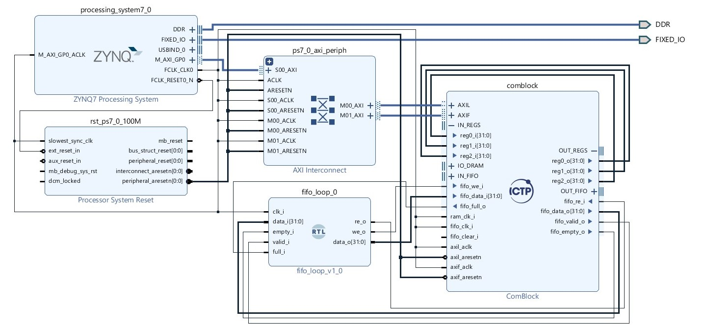

# Prueba de funcionamiento del API

A partir del [ejemplo de testo](https://gitlab.com/rodrigomelo9/core-comblock/-/tree/master/examples/test) provisto por los autores del módulo de comunicación comblock se reconstruyó la funcionalidad del sistema implementado y se empaqueto el diseñó como un overlay de PYNQ ([testOverlay](https://github.com/DanielEstrada971102/Comblock-PYNQ-API/tree/main/comblock/test/testOverlay)), con esto es posible 
testear el funcionamiento del aplicativo de Python para el comblock con el código [comblock_test.py](https://github.com/DanielEstrada971102/Comblock-PYNQ-API/blob/main/comblock/test/comblock_test.py). El diagrama de bloques del overlay implementado y el resultado de ejecutar el código de testo se presentan a continuación.

---
## OUTPUT:

Testing the Input and output Registers... 

=====================================

Writing 0 in the Output REG0 

Writing 1 in the Output REG1 

Writing 2 in the Output REG2 

Reading the Input REG0 = 2 

Reading the Input REG1 = 1 

Reading the Input REG2 = 0 

Testing the Input and output FIFO...

=====================================

Writing the numbers from 0 to 63 in the Output FIFO 

Checking the Input FIFO values...

The values match
Testing the DRAM...

=====================================

Writing the numbers from 0 to 63 in the RAM 

Checking the DRAM values...

The values match

Testing some invalid transactions messages...

WARNING: your overlay doesn't have this register connected
Error: this memory address  is not an input or output register, verify the 'offset' parameter
